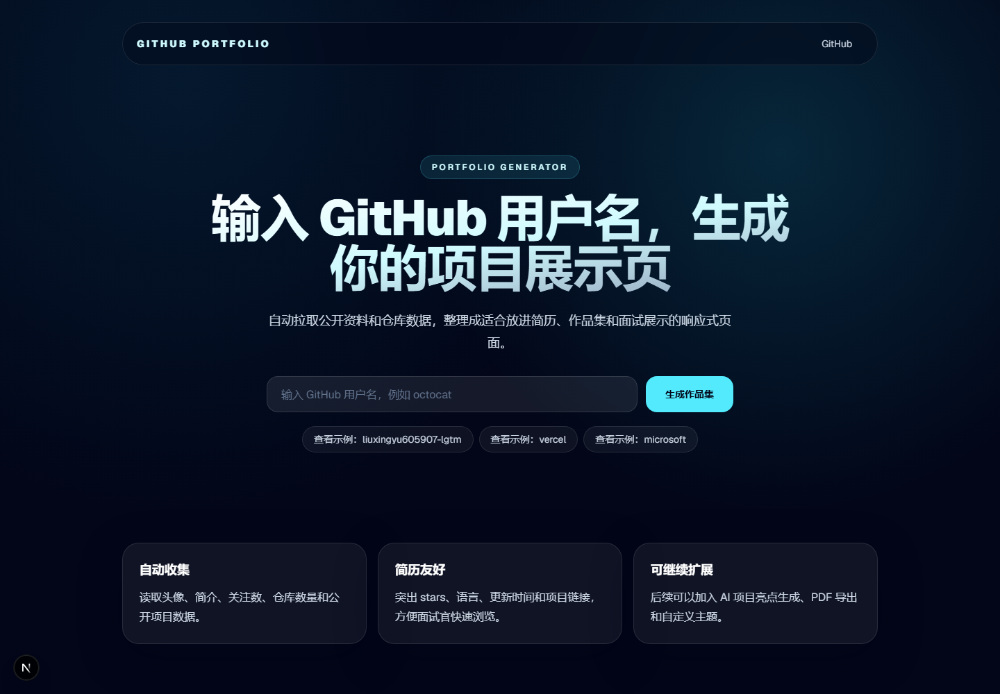
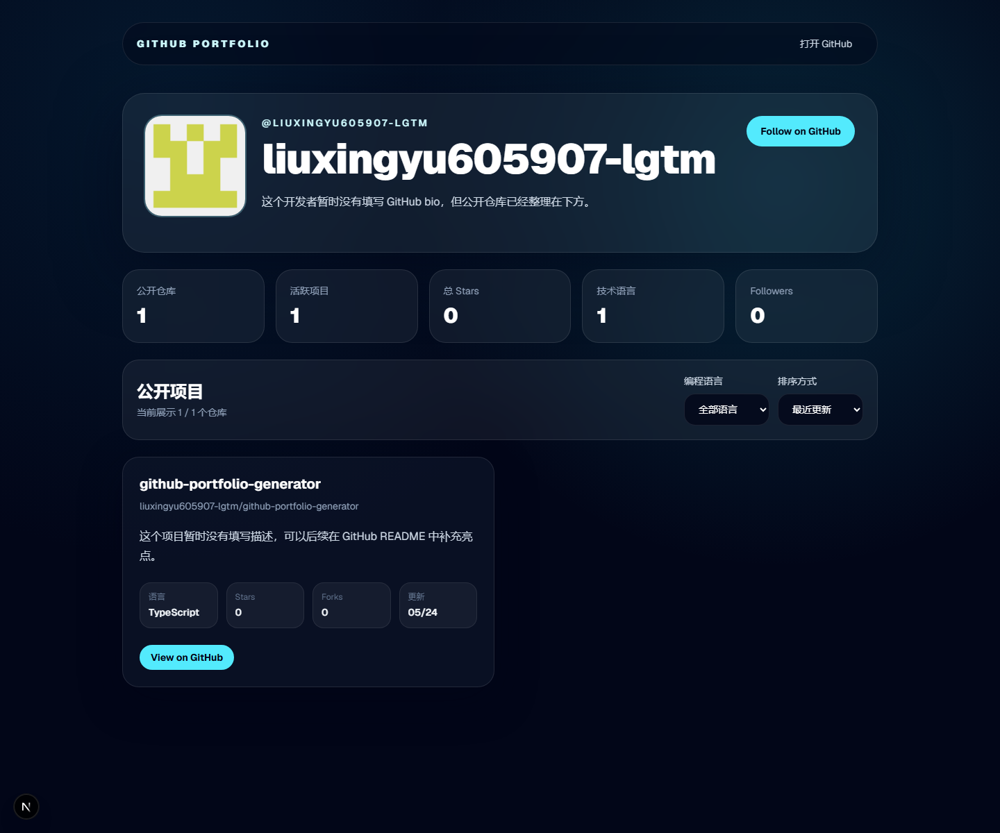

# GitHub Portfolio Generator

输入 GitHub 用户名，自动生成适合简历展示的项目作品集页面。

## 在线预览

- Demo: 部署到 Vercel 后填写链接
- GitHub: https://github.com/liuxingyu605907-lgtm/github-portfolio-generator

## 项目截图

> 部署或本地运行后截图，并替换下面的图片路径。





## 功能

- 输入 GitHub 用户名并跳转到个人作品集页
- 展示头像、昵称、bio、followers、公开仓库等资料
- 拉取最多 100 个公开仓库并生成项目卡片
- 支持按编程语言筛选仓库
- 支持按最近更新、stars、forks、项目名称排序
- 处理用户不存在、无公开仓库、GitHub API 请求失败等状态

## 技术栈

- Next.js
- TypeScript
- Tailwind CSS
- GitHub REST API

## 本地运行

```bash
npm install
npm run dev
```

如果 GitHub API 出现限流，可以在本地新建 `.env.local`：

```text
GITHUB_TOKEN=你的 GitHub token
```

这个变量只在服务端请求 GitHub API 时使用，不要提交到 GitHub。

打开浏览器访问：

```text
http://localhost:3000
```

示例页面：

```text
http://localhost:3000/u/liuxingyu605907-lgtm
```

如果你的账号还没有公开仓库，可以用下面的账号测试仓库卡片、筛选和排序：

```text
http://localhost:3000/u/vercel
```

## 可继续扩展

- AI 自动生成项目亮点和简历描述
- 支持选择 3-6 个项目生成简历项目区
- 支持导出 Markdown 或 PDF
- 支持自定义主题色和个人介绍文案

## 简历描述示例

基于 Next.js 和 GitHub REST API 开发的个人项目展示页生成器，用户输入 GitHub 用户名后可自动拉取公开仓库信息，并生成响应式作品集页面。项目支持仓库排序、语言筛选、异常状态处理和 Vercel 部署。

## 部署

推荐部署到 Vercel。导入 GitHub 仓库后，保持默认构建配置即可。

默认配置：

- Framework Preset: Next.js
- Build Command: `npm run build`
- Output Directory: `.next`
- Install Command: `npm install`
